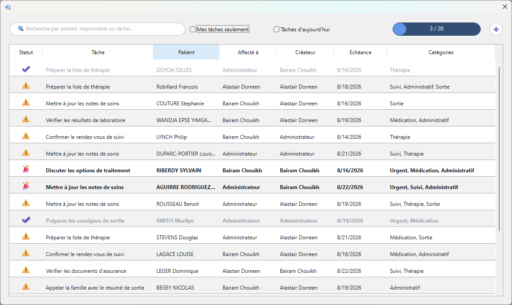
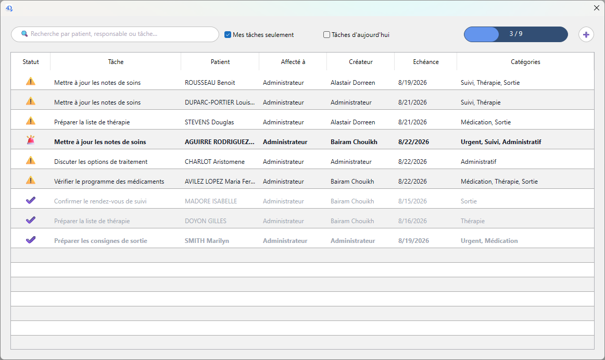
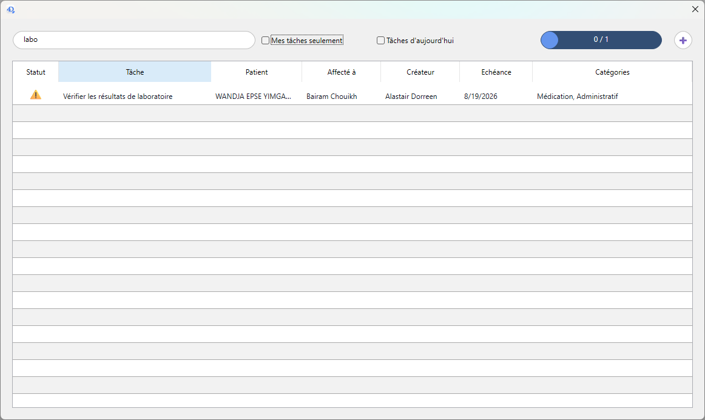
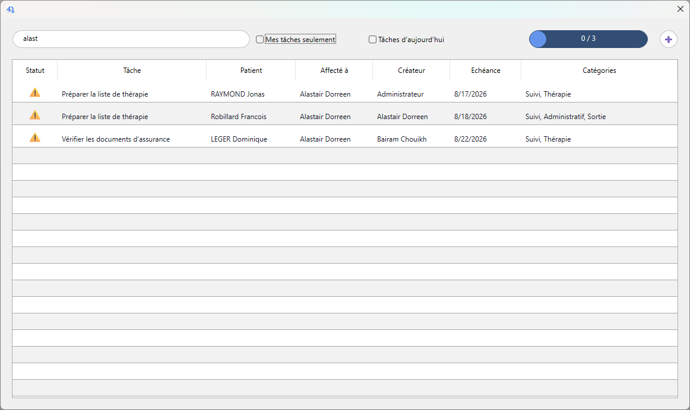
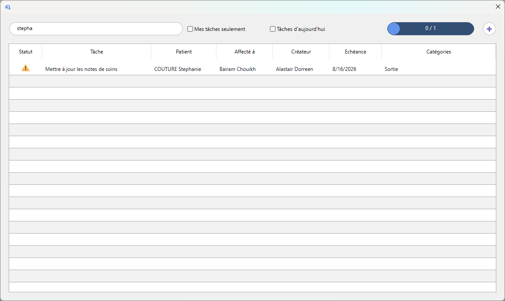
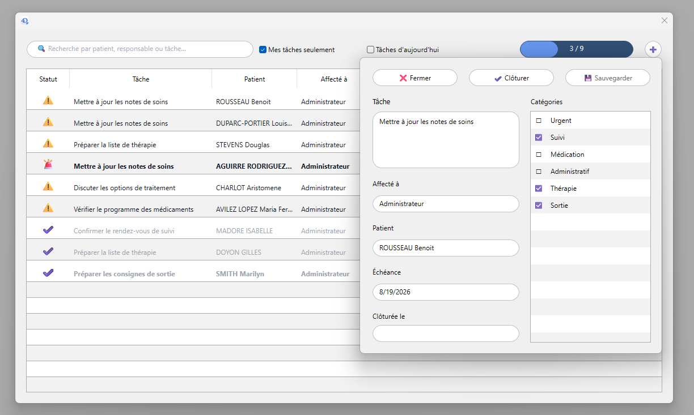

# 4D Todo — composant Syseo Endo

`4D Todo` est un composant 4D destiné à être intégré à **Syseo Endo**. Il permet aux équipes de suivre les tâches associées aux patients, de les affecter aux utilisateurs et de contrôler leur avancement.

Ce document comporte deux parties : un guide d’utilisation de l’interface, puis une référence technique destinée aux développeurs.

## 1. Guide utilisateur — interface et interactions

### Comprendre le tableau de bord

Le tableau principal regroupe les tâches et leurs informations essentielles :

| Colonne | Signification |
| --- | --- |
| **Statut** | Indique si la tâche est ouverte, urgente ou clôturée. |
| **Tâche** | Décrit l’action à réaliser. |
| **Patient** | Identifie le patient concerné. |
| **Affecté à** | Indique la personne responsable de la tâche. |
| **Créateur** | Indique la personne ayant créé la tâche. |
| **Échéance** | Affiche la date à laquelle la tâche doit être réalisée. |
| **Catégories** | Regroupe les thèmes associés à la tâche. |



La zone située en haut de l’écran contient :

- Le champ de recherche.
- Les filtres **Mes tâches seulement** et **Tâches d’aujourd’hui**.
- Une barre de progression indiquant le nombre de tâches clôturées parmi les tâches actuellement affichées.
- Le bouton **➕** pour créer une tâche.

### Reconnaître le statut et la priorité

Les repères visuels permettent d’identifier rapidement l’état d’une tâche :

- **⚠️** signale une tâche ouverte.
- **🚨** signale une tâche appartenant à la catégorie `Urgent`. Sa ligne est affichée en gras.
- **✔️** signale une tâche clôturée. Son texte apparaît en gris.
- Un fond rouge signale une tâche en retard ou arrivant à échéance aujourd’hui.
- Un fond orange signale une tâche arrivant à échéance demain.

### Filtrer la liste

Cochez **Mes tâches seulement** pour ne conserver que les tâches qui vous sont affectées. Décochez cette option pour consulter toutes les tâches accessibles.



Cochez **Tâches d’aujourd’hui** pour afficher uniquement les tâches dont l’échéance correspond à la date du jour. Les deux filtres peuvent être combinés avec la recherche.

La barre de progression est recalculée à partir de la liste filtrée. Par exemple, `3 / 9` signifie que trois des neuf tâches affichées sont clôturées.

### Rechercher une tâche

Saisissez un ou plusieurs termes dans le champ **Recherche par patient, responsable ou tâche…**. La liste est actualisée pendant la saisie.

La recherche porte sur :

- Le texte de la tâche.
- Le nom du responsable.
- Le nom du patient.
- Le prénom du patient.

Une partie d’un mot suffit. L’exemple suivant retrouve une tâche contenant « laboratoire » :



La recherche peut également retrouver les tâches d’un responsable :



Elle permet enfin de rechercher un patient par son nom ou son prénom :



Pour revenir à la liste complète, effacez le contenu du champ de recherche et désactivez les filtres qui ne sont plus nécessaires.

### Consulter ou modifier une tâche

Cliquez sur une ligne pour ouvrir sa fiche. Celle-ci présente :

- La description de la tâche.
- Le responsable.
- Le patient.
- L’échéance.
- La date et l’heure de clôture, si la tâche est terminée.
- Les catégories disponibles et celles qui sont sélectionnées.



Les actions proposées dépendent de votre rôle vis-à-vis de la tâche :

- **Fermer** quitte la fiche sans enregistrer les modifications en cours.
- **Sauvegarder** enregistre les modifications. Une tâche ouverte ne peut être modifiée que par son créateur.
- **Clôturer** termine une tâche ouverte. Cette action est disponible pour son créateur ou son responsable.
- **Rouvrir** remplace le bouton **Clôturer** lorsqu’une tâche est déjà terminée. Cette action est également réservée au créateur ou au responsable.

Une tâche clôturée est affichée en lecture seule. Après sa réouverture, seul son créateur peut de nouveau modifier son contenu.

### Créer une tâche

Cliquez sur le bouton **➕** en haut à droite pour ouvrir une fiche vierge, puis :

1. Saisissez la description dans le champ **Tâche**.
2. Cliquez sur **Affecté à** et choisissez un responsable dans la liste.
3. Cliquez sur **Patient** et choisissez le patient concerné.
4. Saisissez la date d’**Échéance**.
5. Cliquez sur les catégories voulues pour les cocher ou les décocher.
6. Cliquez sur **Sauvegarder** pour créer la tâche, ou sur **Fermer** pour annuler.

Le créateur et la date de création sont renseignés automatiquement. Le bouton **Clôturer** et le champ **Clôturée le** ne sont pas actifs lors de la création d’une nouvelle tâche.

Dans les listes de sélection, les responsables sont triés par nom et les patients par nom de famille. Double-cliquez sur un élément pour valider votre choix.

## 2. Guide développeur — architecture et intégration

### Rôle du composant

Le projet est un composant de gestion de tâches destiné à **Syseo Endo**. L’application hôte doit lui transmettre l’identifiant de l’utilisateur courant lors de l’ouverture du tableau de bord :

```4d
cs.TodoForm.new($userId).dialog()
```

`$userId` doit correspondre à une valeur existante de `Utilisateur.xNumUser`. Cet identifiant détermine les tâches personnelles, les autorisations de modification et les autorisations de clôture ou de réouverture.

Le raccordement concret au cycle de vie et à l’interface de Syseo Endo n’est pas inclus dans ce dépôt.

### Pile technique

- Projet desktop 4D avec une valeur `compatibilityVersion` de `2130`.
- Accès aux données par l’API ORDA et le datastore `ds`.
- Formulaires projet JSON associés à des classes au moyen de `formClass`.
- Fichier de données local et journal 4D dans `Data/`.
- Journalisation activée dans le catalogue.

### Structure du projet

```text
Project/
├── 4d-todo.4DProject
└── Sources/
    ├── catalog.4DCatalog         # Modèle, relations et index
    ├── Classes/
    │   ├── TodoForm.4dm          # Tableau, recherche, filtres et progression
    │   ├── NewTodoForm.4dm       # Création, édition et droits de la fiche
    │   ├── PickerForm.4dm        # Sélecteur générique
    │   └── Timestamp.4dm         # Conversion des horodatages
    ├── DatabaseMethods/
    │   └── onStartup.4dm         # Démarrage du lanceur de test
    ├── Forms/
    │   ├── Form1/                # Tableau de bord
    │   ├── Form2/                # Fiche d’une tâche
    │   └── Picker/               # Sélection patient/utilisateur
    └── Methods/
        ├── _.4dm                  # Lanceur autonome réservé aux tests
        └── seed.4dm               # Génération facultative de données
```

Les dossiers `Data/`, `DerivedData/`, `Libraries/` et les préférences utilisateur sont exclus du suivi Git par `.gitignore`.

### Modèle de données

| Table | Rôle | Champs principaux |
| --- | --- | --- |
| `Todo` | Tâche et cycle de vie | `ID`, `patient_id`, `label`, `created_at`, `created_by`, `assigned_to`, `completed_at`, `due_date` |
| `Patient` | Patient associé à une tâche | `NoDossier`, `Nom`, `Prénom` |
| `Utilisateur` | Créateur ou responsable | `xNumUser`, `Nom` |
| `TodoCategory` | Référentiel des catégories | `ID`, `label` |
| `TodoCategories` | Liaison plusieurs-à-plusieurs | `ID`, `todo_id`, `category_id` |

Le catalogue expose les relations ORDA suivantes :

- `Todo.patient` vers `Patient`.
- `Todo.creator` et `Todo.assignee` vers `Utilisateur`.
- `Todo.todoCategories` vers la table de liaison.
- `TodoCategories.category` vers `TodoCategory`.

Les clés primaires, les noms et les clés étrangères utilisées dans les recherches disposent d’index.

### Contrôleur du tableau de bord

`TodoForm` conserve l’utilisateur courant, la sélection ORDA affichée, la tâche sélectionnée, le texte de recherche, les filtres et la progression.

La méthode `filter()` :

1. Découpe la recherche en mots et ajoute des jokers `@`.
2. Recherche dans `Todo.label`, `assignee.Nom`, `patient.Nom` et `patient.Prénom`.
3. Ajoute les critères `assigned_to` et `due_date` selon les cases cochées.
4. Trie les résultats filtrés par `completed_at`, puis `due_date`.
5. Recalcule le compteur et la barre de progression sur la sélection obtenue.

Sans recherche ni filtre, la sélection revient à `ds.Todo.all()`.

Un clic sur une ligne appelle `editTask()`, recharge l’entité par son identifiant, ouvre `NewTodoForm`, puis actualise la liste à la fermeture de la fiche.

### Création, édition et autorisations

`NewTodoForm` fonctionne dans deux modes :

- Sans entité transmise, il crée une nouvelle tâche, initialise l’échéance à la date courante et autorise l’édition.
- Avec une entité existante, il recharge la tâche et ses catégories, puis calcule les droits disponibles.

Les règles appliquées côté interface et de nouveau vérifiées lors de l’enregistrement sont :

- Seul le créateur peut modifier une tâche ouverte.
- Une tâche clôturée ne peut pas être modifiée.
- Le créateur ou le responsable peut clôturer ou rouvrir la tâche.

Pour une nouvelle tâche, `btnSave.4dm` renseigne `created_at` et `created_by`. Pour une modification, il recharge et contrôle l’entité avant l’écriture. Les anciennes lignes `TodoCategories` sont ensuite supprimées et recréées depuis la sélection courante.

### Horodatages

`created_at` et `completed_at` sont des entiers représentant le nombre de secondes depuis le 1er janvier 1970. La classe partagée `Timestamp` fournit :

- `now()` pour produire l’horodatage courant.
- `buildStamp()` pour convertir une date et une heure.
- `stampToDate()` et `stampToTime()` pour l’affichage.

### Exécution autonome de test

La méthode projet `_` n’est pas le point d’entrée de production. Elle sert uniquement à tester le composant hors de Syseo Endo :

```4d
cs.TodoForm.new(12).dialog()
```

La méthode base `On Startup` appelle ce lanceur. L’identifiant `12` est donc une donnée de test à remplacer par un `Utilisateur.xNumUser` valide si nécessaire. En mode SDI, la fermeture du tableau de bord entraîne la fermeture de 4D.

Pour exécuter ce scénario :

1. Ouvrir `Project/4d-todo.4DProject` dans une version compatible de 4D.
2. Ouvrir ou créer un fichier de données.
3. Exécuter le projet.

### Données de démonstration

La méthode facultative `seed` importe `patients.json` et `users.json` depuis le bureau, crée les six catégories de démonstration, puis génère 20 tâches aléatoires.

> **Attention :** `seed` supprime les tâches, les liens de catégories et les catégories existantes. Elle doit uniquement être exécutée avec des données jetables ou sauvegardées. Les fichiers JSON doivent être valides et fournir au moins un patient ainsi que les utilisateurs attendus par la méthode.

### Limites techniques actuelles

- Le raccordement du composant à Syseo Endo reste à réaliser dans le projet hôte.
- `roles.json` ne force pas l’authentification et ne définit aucun rôle ou privilège.
- Le formulaire ne présente pas de retour explicite en cas d’échec de validation ou d’enregistrement.
- Les patients, utilisateurs et catégories ne sont pas administrables depuis cette interface.
- Le composant utilise des formulaires desktop à dimensions fixes et ne fournit pas d’interface web ou mobile.
- Le dépôt ne contient pas de suite de tests automatisés.
